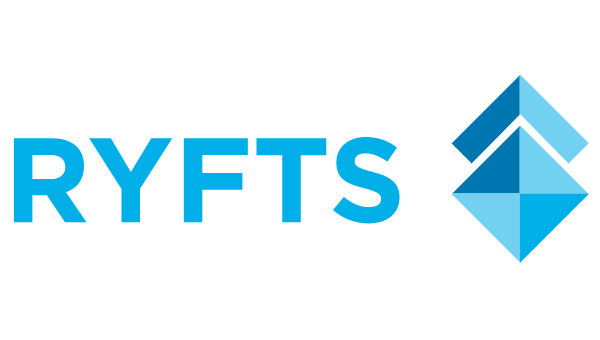

# Ryfts ICO contracts

### Development

1. Run `npm install` to install all required dependencies.
2. Copy `truffle.js.sample` to `truffle.js`. Update required information in the file.

Commands:
 - `npm run test` - run unit tests
 - `npm run deploy-ropsten` - make migrations on Ropsten network
 - `npm run deploy-mainnet` - make migrations on Mainnet network